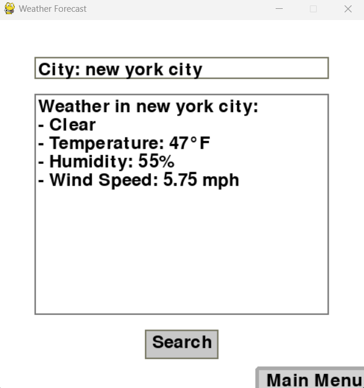
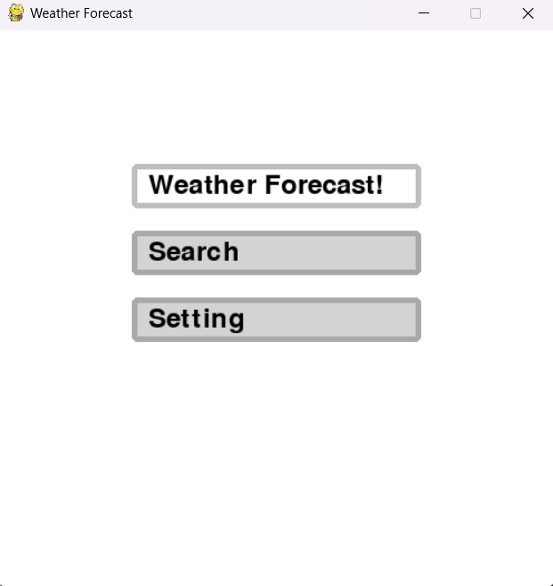

# Weather Forecast 
## CS110 Final Project Spring, 2024 

## Team Members

Kevin Wang 

***

## Project Description

The project will be a weather GUI that allows users to search up different city's weather. The GUI will provide information on weather, wind speed, humidity, and temperature. The GUI will also have background music with the setting to pause and unpause the music 

***    

## GUI Design

### Initial Design

### Final Design

## Program Design

### Features

1.  Search for Weather 
2.  Search for Temperature 
3.  Search for Wind Speed 
4.  Search for Humidity 
5.  Play Music / Stop Music

### Classes

- << You should have a list of each of your classes with a description >>

## ATP

| Step | Action                                      |  Expected
|------|---------------------------------------------|-------------------------------------------------
| 1    | Open the application.     | The main menu is displayed with a "Search"button.                |
| 2    | Click the search button   | The search button GUI is opened up                               |
| 3    | Enter a city name         | Information about the City's temperature, weather, humidity, and wind speed will show                                                                                                  |
| 4    | Enter an invald city name into the city input box and press "Search". | The application displays "No weather data found" or |a  similar message.                                                                                    |
| 6    | Click main menu           | Go back to home GUI                                              |   
| 7    | Click setting             | Search GUI opens up                                              |   
| 8    | Click volume pauses       | Volume Pauses                                                    |   
| 9    | Click Volume unpauses     | Volume unpauses                                                  |   
 
